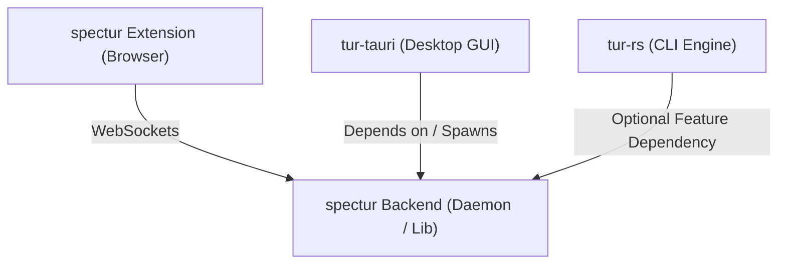

# spectur

[](https://crates.io/crates/spectur)
[](https://www.gnu.org/licenses/gpl-3.0)

`spectur` is the browser interceptor and stream-resolving companion for the **tur** download suite. It intercepts media requests browser-side, extracts segment/stream lists from manifests (HLS/DASH/Progressive), and interfaces directly with download engines.

---

## The `tur` Family Ecosystem

`spectur` is one part of a unified, modular download system designed for power users:



*   **[`tur-rs`](https://github.com/greykaizen/tur-rs)**: The core command-line download engine, scheduler, and parser.
*   **`tur-tauri`**: The premium cross-platform desktop user interface built with Tauri and React.
*   **`spectur`** (This Repository): The browser extension (`/extension`) and its companion protocol server (`/backend`), providing seamless "one-click" intercept-to-download integration.

---

## How It Works

1. **Intercept**: The browser extension uses modern `webRequest` APIs to capture media playlists (`.m3u8`, `.mpd`) and progressive video streams (`.mp4`), along with all authentication headers, cookies, and tokens.
2. **Resolve**: The extension forwards these raw details to the `spectur` backend over WebSockets.
3. **Probe**: The backend fetches the playlist/manifest (replaying the original browser request headers), parses the tracks/resolutions, and builds a comprehensive stream specification.
4. **Download**: The stream specifications and media segments are handed off to `tur-rs` to fetch and merge high-fidelity streams.

---

## Repository Structure

This repository is organized as a monorepo containing both the extension frontend and the protocol backend:

*   **[`/backend`](file:///home/kaizen/Repo/spectur/backend)**:
    *   Written in **Rust**.
    *   Exposes a library crate on [crates.io](https://crates.io/crates/spectur) for direct integration into `tur-rs` or custom downloaders.
    *   Includes a standalone binary backend server that runs a WebSocket daemon and a lightweight TUI dashboard.
*   **[`/extension`](file:///home/kaizen/Repo/spectur/extension)**:
    *   Written in **TypeScript** using the **WXT** framework.
    *   Compiles target extensions for Firefox and Chrome.

---

## Getting Started

### Prerequisites

*   [Rust](https://www.rust-lang.org/tools/install) (2024 Edition)
*   [Node.js](https://nodejs.org/) & `npm`

### Building the Extension

```bash
cd extension
npm install
npm run build           # Build production bundles
npm run dev:firefox     # Start WXT dev mode targeting Firefox
```

### Running the Backend Daemon

To run the standalone WebSocket daemon with the built-in console UI:

```bash
cd backend
cargo run --bin spectur
```

## License

This project is licensed under the **GPL-3.0-only** license.
